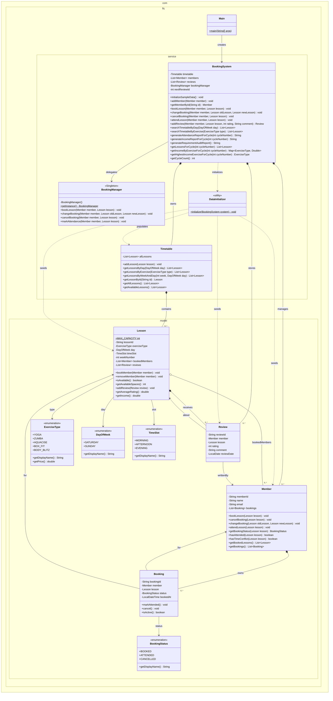

# FLC Booking System UML (Class Diagram)

This Mermaid class diagram is aligned to the current codebase and keeps the focus on the core assignment classes.

```mermaid
classDiagram
    direction TB

    namespace com.flc {
        class Main {
            +main(String[] args)$
        }
    }

    namespace com.flc.service {
        class BookingSystem {
            -Timetable timetable
            -List~Member~ members
            -List~Review~ reviews
            -BookingManager bookingManager
            -int nextReviewId
            +initializeSampleData() void
            +addMember(Member member) void
            +getMemberById(String id) Member
            +bookLesson(Member member, Lesson lesson) void
            +changeBooking(Member member, Lesson oldLesson, Lesson newLesson) void
            +cancelBooking(Member member, Lesson lesson) void
            +attendLesson(Member member, Lesson lesson) void
            +addReview(Member member, Lesson lesson, int rating, String comment) Review
            +searchTimetableByDay(DayOfWeek day) List~Lesson~
            +searchTimetableByExercise(ExerciseType type) List~Lesson~
            +generateAttendanceReportForCycle(int cycleNumber) String
            +generateIncomeReportForCycle(int cycleNumber) String
            +generateRequirementAuditReport() String
            +getLessonsForCycle(int cycleNumber) List~Lesson~
            +getIncomeByExerciseForCycle(int cycleNumber) Map~ExerciseType, Double~
            +getHighestIncomeExerciseForCycle(int cycleNumber) ExerciseType
            +getCycleCount() int
        }

        class BookingManager {
            <<Singleton>>
            -BookingManager()
            +getInstance() BookingManager$
            +bookLesson(Member member, Lesson lesson) void
            +changeBooking(Member member, Lesson oldLesson, Lesson newLesson) void
            +cancelBooking(Member member, Lesson lesson) void
            +markAttendance(Member member, Lesson lesson) void
        }

        class Timetable {
            -List~Lesson~ allLessons
            +addLesson(Lesson lesson) void
            +getLessonsByDay(DayOfWeek day) List~Lesson~
            +getLessonsByExercise(ExerciseType type) List~Lesson~
            +getLessonsByWeekAndDay(int week, DayOfWeek day) List~Lesson~
            +getLessonById(String id) Lesson
            +getAllLessons() List~Lesson~
            +getAvailableLessons() List~Lesson~
        }

        class DataInitializer {
            <<utility>>
            +initialize(BookingSystem system)$ void
        }
    }

    namespace com.flc.model {
        class Member {
            -String memberId
            -String name
            -String email
            -List~Booking~ bookings
            +bookLesson(Lesson lesson) void
            +cancelBooking(Lesson lesson) void
            +changeBooking(Lesson oldLesson, Lesson newLesson) void
            +attendLesson(Lesson lesson) void
            +getBookingStatus(Lesson lesson) BookingStatus
            +hasAttended(Lesson lesson) boolean
            +hasTimeConflict(Lesson lesson) boolean
            +getBookedLessons() List~Lesson~
            +getBookings() List~Booking~
        }

        class Lesson {
            +MAX_CAPACITY int$
            -String lessonId
            -ExerciseType exerciseType
            -DayOfWeek day
            -TimeSlot timeSlot
            -int weekNumber
            -List~Member~ bookedMembers
            -List~Review~ reviews
            +bookMember(Member member) void
            +removeMember(Member member) void
            +isAvailable() boolean
            +getAvailableSpaces() int
            +addReview(Review review) void
            +getAverageRating() double
            +getIncome() double
        }

        class Booking {
            -String bookingId
            -Member member
            -Lesson lesson
            -BookingStatus status
            -LocalDateTime bookedAt
            +markAttended() void
            +cancel() void
            +isActive() boolean
        }

        class Review {
            -String reviewId
            -Member member
            -Lesson lesson
            -int rating
            -String comment
            -LocalDate reviewDate
        }

        class ExerciseType {
            <<enumeration>>
            +YOGA
            +ZUMBA
            +AQUACISE
            +BOX_FIT
            +BODY_BLITZ
            +getDisplayName() String
            +getPrice() double
        }

        class DayOfWeek {
            <<enumeration>>
            +SATURDAY
            +SUNDAY
            +getDisplayName() String
        }

        class TimeSlot {
            <<enumeration>>
            +MORNING
            +AFTERNOON
            +EVENING
            +getDisplayName() String
        }

        class BookingStatus {
            <<enumeration>>
            +BOOKED
            +ATTENDED
            +CANCELLED
            +getDisplayName() String
        }
    }

    Main --> BookingSystem : creates

    BookingSystem *-- Timetable : owns
    BookingSystem *-- "0..*" Member : manages
    BookingSystem *-- "0..*" Review : stores
    BookingSystem --> BookingManager : delegates
    BookingSystem ..> DataInitializer : initializes

    Timetable *-- "0..*" Lesson : contains
    DataInitializer ..> Timetable : populates
    DataInitializer ..> Member : seeds
    DataInitializer ..> Lesson : seeds
    DataInitializer ..> Review : seeds

    Member *-- "0..*" Booking : owns
    Lesson o-- "0..*" Member : bookedMembers
    Lesson *-- "0..*" Review : receives

    Booking --> Member : for
    Booking --> Lesson : for
    Booking --> BookingStatus : status

    Review --> Member : writtenBy
    Review --> Lesson : about

    Lesson --> ExerciseType : type
    Lesson --> DayOfWeek : day
    Lesson --> TimeSlot : slot
```
