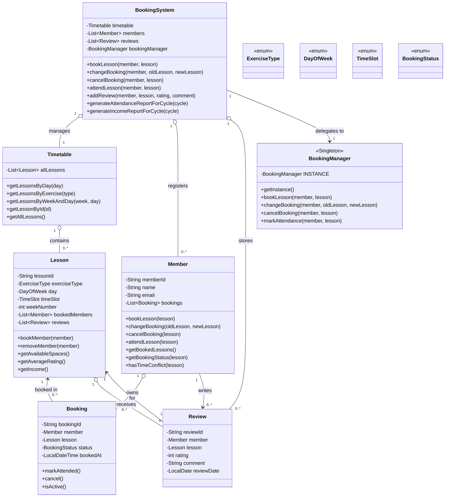

# FLC Booking System UML (Class Diagram)

```mermaid
classDiagram
    class BookingSystem {
        -Timetable timetable
        -List~Member~ members
        -List~Review~ reviews
        -BookingManager bookingManager
        +bookLesson(member, lesson)
        +changeBooking(member, oldLesson, newLesson)
        +cancelBooking(member, lesson)
        +attendLesson(member, lesson)
        +addReview(member, lesson, rating, comment)
        +generateAttendanceReportForCycle(cycle)
        +generateIncomeReportForCycle(cycle)
    }

    class BookingManager {
        <<Singleton>>
        -BookingManager INSTANCE
        +getInstance()
        +bookLesson(member, lesson)
        +changeBooking(member, oldLesson, newLesson)
        +cancelBooking(member, lesson)
        +markAttendance(member, lesson)
    }

    class Timetable {
        -List~Lesson~ allLessons
        +getLessonsByDay(day)
        +getLessonsByExercise(type)
        +getLessonsByWeekAndDay(week, day)
        +getLessonById(id)
        +getAllLessons()
    }

    class Member {
        -String memberId
        -String name
        -String email
        -List~Booking~ bookings
        +bookLesson(lesson)
        +changeBooking(oldLesson, newLesson)
        +cancelBooking(lesson)
        +attendLesson(lesson)
        +getBookedLessons()
        +getBookingStatus(lesson)
        +hasTimeConflict(lesson)
    }

    class Booking {
        -String bookingId
        -Member member
        -Lesson lesson
        -BookingStatus status
        -LocalDateTime bookedAt
        +markAttended()
        +cancel()
        +isActive()
    }

    class Lesson {
        -String lessonId
        -ExerciseType exerciseType
        -DayOfWeek day
        -TimeSlot timeSlot
        -int weekNumber
        -List~Member~ bookedMembers
        -List~Review~ reviews
        +bookMember(member)
        +removeMember(member)
        +getAvailableSpaces()
        +getAverageRating()
        +getIncome()
    }

    class Review {
        -String reviewId
        -Member member
        -Lesson lesson
        -int rating
        -String comment
        -LocalDate reviewDate
    }

    class ExerciseType {
        <<enum>>
    }

    class DayOfWeek {
        <<enum>>
    }

    class TimeSlot {
        <<enum>>
    }

    class BookingStatus {
        <<enum>>
    }

    BookingSystem "1" o-- "1" Timetable : manages
    BookingSystem "1" o-- "0..*" Member : registers
    BookingSystem "1" o-- "0..*" Review : stores
    BookingSystem "1" --> "1" BookingManager : delegates to

    Timetable "1" o-- "0..*" Lesson : contains

    Member "1" o-- "0..*" Booking : owns
    Lesson "1" <-- "0..*" Booking : booked in

    Lesson "1" o-- "0..*" Review : receives
    Member "1" --> "0..*" Review : writes
    Review "1" --> "1" Lesson : for
```

